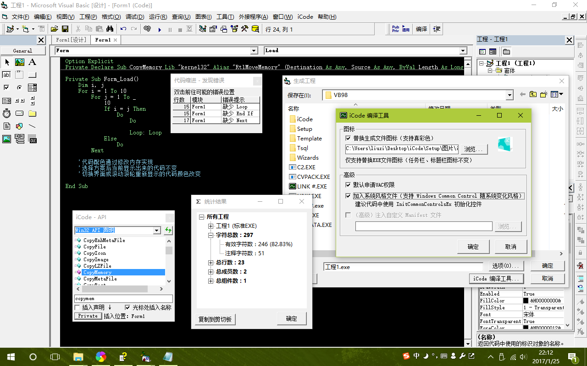
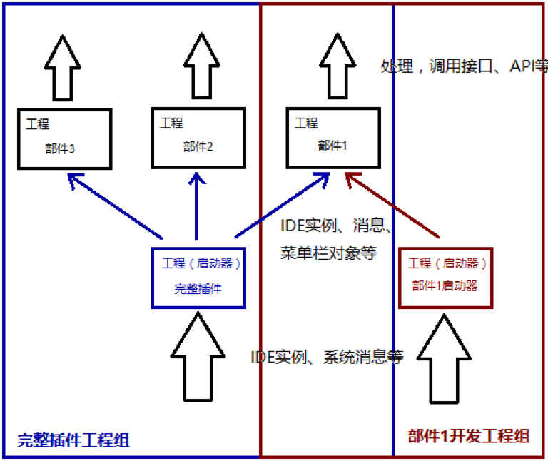

# iCode: an addin for Microsoft Visual Basic 6.0

重新整理于 2019/11/09

这是一个年代久远的 Project...我在小学时接触了 VB6，陆陆续续也写了不少程序。升初中的那个暑假，似乎是怀着“打算学习新的语言了，最后用 VB 给 VB6 写个插件当告别吧“的想法（现在看来好中二啊 hhh），开始了这个工程。然而它并不是我预想的”告别之作“，而是伴随了我整个初中三年，从最初的“小插件”，逐步拓展到了一个庞大的工程，即使到了现在，可能也是我写过的最大的工程了吧（笑）

Microsoft Visual Basic 6.0，一个年纪比我还要大的 IDE/语言，在我编写这个程序之时，VB6 已经开始淡出人们的视野了，而现在，大概已经只存在记忆中了吧。在高三时，自觉不会再维护这个项目了，于是抽空完善了一下文档，并在百度贴吧 VB 吧发布了程序和源码。由于 VB 用户已是寥寥无几，它并没有引起多大的关注，这一点我也已自知。

现在回想起来，这个工程让我学到了很多，即使是自己摸索，数年下来，虽然不算系统，也学到了不少知识，例如：
* VB6 “类”的使用
* VB6 外接程序 Addin 架构、接口等
* WIN32 Hook、回调与接口、DLL 注入、内存读写
* WIN32 API、消息、事件
* WIN32 程序 Resource
* 对程序架构、单元测试的初步理解
当然，对于专业的 Windows 开发者而言，这些可能不过是些皮毛而已。

现在这个程序已经停止维护，我也不会提供技术支持了（我也差不多忘光了 hhh），程序有不少 Bug，代码风格也不算好。考虑到现在基本没有人用 VB6 了，这个 Addin 本身也没有什么实用价值了，但如果其中的一些技术点能够给您提供参考，那它也算是发挥了它的价值了 :)

`Develop/iCode 开发者指南.docx` 是我在发布源码时编写的文档，其中一些内容整理如下。

## Addin 外接程序
VB6 外接程序（Addin）是使用 VB 提供的接口增强 IDE 上实现特定功能的插件。工程主体是 ActiveX DLL，调用了特定的部件（Microsoft Add-In Designer 等），这些部件将提供有限的接口用于控制IDE行为。本工程中还使用了 Hook、内存修改等。接口与流程概述详见 docx 文档。

## 程序部件

### Linker – 编译强化
编译强化工具。自动替换 EXE 文件图标，支持高清图标；自动插入 Manifest 文件，以实现自动申请 UAC 权限、通用控件跟随系统主题等功能。

### TipsBar – 工作区标签栏
为 IDE 的工作区增加标签栏，方便在各个窗口间切换。

### AutoComplete - API工具
集合 WIN32 API 和 GDI+ 方法、常数、类型，自动插入声明。

### CodeIndent – 代码缩进整理
优化的代码缩进整理工具，附带简单的代码错误分析。

### CodeStatistic – 代码统计
细致全面的代码统计工具。

### ColorCode – 代码色彩修改器
通过修改内存实现 IDE 配色自定义，突破 VB 单调配色，附带方案导入、导出功能。

### IDEEnhancer – IDE工具
提升效率。

### Windows – 文件窗口重布局
重新布局文件窗口控件。

## 目录结构

* Components：各个组件的工程文件。
* Public：各个组件公用的工程文件。
* iCode：iCode主启动器的工程文件
* Develop：开发参考文档、辅助测试工程。
* Documents：相关文档和资源。
* Dlls：编译输出目录
* Setup：安装、卸载程序、帮助文件的工程、制作工具、成品等。
* CleanUp.bat：用于清理各种tmp、log文件，以及 VB 崩溃可能在 Components 文件夹下留下的“工程1.vbp”等文件
* iCode.vbg是iCode主体工程文件。

## 工程架构

iCode 的架构修改过多次，现在采用的是各个部件工程独立，启动器（含 Connect）独立另一个工程，启动器工程（称为 A）引用部件工程（称为 B），通过调用类模块的接口实现功能。主要代码都在 B 中编写，A 主要做提供 IDE 实例、提供 Hook 信息等作用。

这样做的好处是方便移植。iCode 由许多组件组成，如果全都在一个工程中编写，会比较混乱，同时不方便调试。要知道，由于用上了 Hook 等，iCode 时常要编译以后再测试，编译其他不必要的组件会浪费许多时间。采用这样的架构，先编写一个部件工程+一个启动器工程，测试完成后，iCode 真正的启动器再引用部件工程，只需添加少量的调用代码即可，如果部件出现问题，也可以通过原启动器调试。

另外，一些公共的方法（主要在 iFunction 中）通过使用同一个代码文件保持同步。

随手画的一张图：

## 其他
* `Develop/iCode.chm` Addin 使用手册
* `Develop/iCode 开发者指南.docx` 包含更多研发时的细节，供参考
* 当年 VB 吧发布帖子：[【V1.2+开源】iCode - VB6实用外接程序（AddIn）【vb吧】_百度贴吧](http://tieba.baidu.com/p/4955504936?pid=103087573171&cid=0#103087573171)（黑历史 hhh）
* 部分参考文档来源互联网，版权归原作者所有
